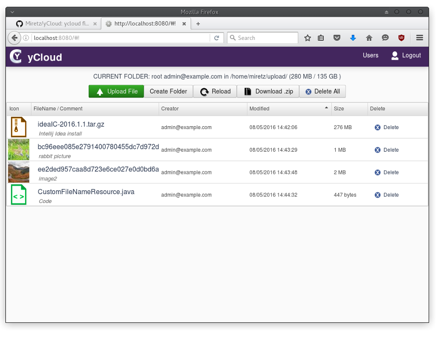
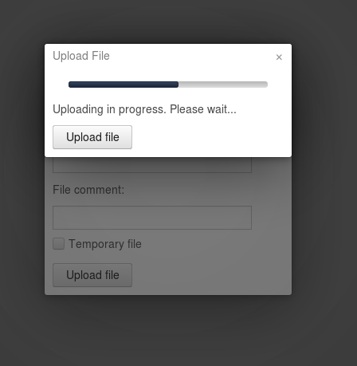
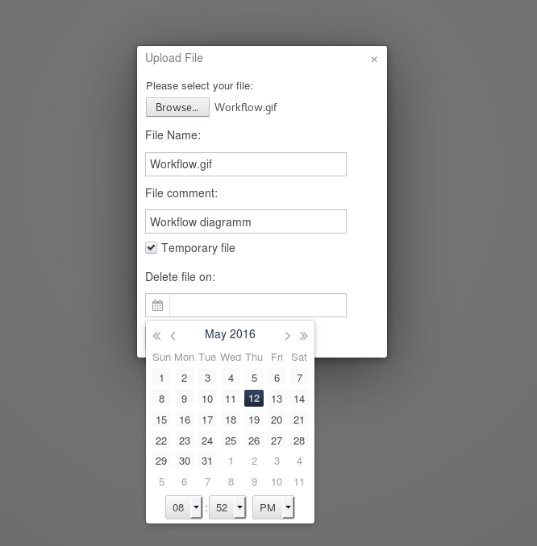

ycloud
==============

File storage application written in Kotlin which uses Vaadin Framework, Google Guice and MongoDB

Before run modify the config.properties file.

By default a fake in memory MongoDB (https://github.com/fakemongo/fongo) is used.

This is a complete Intellij Idea project.
I'm using the community edition.




Features
========
* Secure login
* Secure file storage on the host filesystem
* File Metadata stored in MongoDB
* Temporary files with user defined retention date
* Creation and Management of virtual folders
* User Management
* Image preview
* Icons based on the file type
* Download of all content as a compressed zip file

Upload with Progress Bar
========================




Temporary file support
======================




Workflow
========
Prerequisites
- Apache Maven - to compile and run
- Intellij Idea Community Edition

Modify "config.properties" file which is located in:
```
yCloud/src/main/resources
```
- Set username and password
- Set upload directory (absolute path)

Compile using:
```
mvn clean install
```

Run embedded jetty server:
```
mvn jetty:run
```

Open browser and navigate to:
```
http://localhost:8080/
```

ROADMAP
=======

* Media file playback
* Text editor
* PDF preview
* PPT preview
* Content Indexing (Sorl or Elasticsearch)
* Rest API


